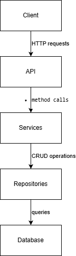
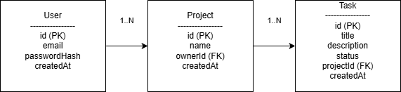

# Лабораторна робота №2

## Розробка структури застосунку

### 1. Загальний опис

Застосунок TaskFlow є серверним застосунком, розробленим на платформі Node.js,
та призначений для управління задачами та проєктами. Архітектура побудована
з використанням багатошарового підходу.

---

### 2. Основні компоненти (модулі) застосунку

Застосунок поділено на такі основні модулі:

- **API Layer (Controllers)**  
  Приймає HTTP-запити від клієнта та повертає відповіді.

- **Auth Module**  
  Відповідає за автентифікацію та авторизацію користувачів.

- **User Module**  
  Забезпечує управління даними користувачів.

- **Project Module**  
  Відповідає за створення та управління проєктами.

- **Task Module**  
  Реалізує функціональність створення, редагування та зміни статусів задач.

- **Service Layer**  
  Містить бізнес-логіку та реалізацію ключових сценаріїв.

- **Repository Layer**  
  Відповідає за взаємодію з базою даних.

- **Database**  
  Зберігає дані застосунку.

---

### 3. Взаємодія компонентів

Взаємодія між компонентами здійснюється за принципом
Controller – Service – Repository.

Клієнт надсилає запит до API, який передає його на рівень сервісів.
Сервіси виконують бізнес-логіку та звертаються до репозиторіїв
для отримання або збереження даних у базі даних.

---

### 4. Діаграма компонентів

### Діаграма компонентів

---

### 5. Опис даних та їх зв’язків

Основні сутності системи:

#### User

- id
- email
- passwordHash
- createdAt

#### Project

- id
- name
- ownerId
- createdAt

#### Task

- id
- title
- description
- status
- projectId
- createdAt

---

### 6. ER-діаграма

### ER-діаграма

Один користувач може мати декілька проєктів,
а кожен проєкт може містити декілька задач.

---

### 7. Ключові сценарії роботи застосунку

#### 7.1 Створення задачі

1. Користувач надсилає запит на створення задачі.
2. API перевіряє авторизацію користувача.
3. Service перевіряє права доступу до проєкту.
4. Дані задачі зберігаються у базі даних.
5. Користувач отримує підтвердження створення задачі.

#### 7.2 Зміна статусу задачі

1. Користувач обирає задачу.
2. Надсилає запит на зміну статусу.
3. Service перевіряє валідність зміни статусу.
4. Оновлені дані зберігаються у базі даних.
5. Користувач отримує оновлену інформацію.

#### 7.3 Отримання списку задач

1. Користувач надсилає запит на отримання задач проєкту.
2. Repository отримує дані з бази.
3. Service агрегує результат.
4. API повертає список задач клієнту.

### Обмеження доступу

Користувач має доступ лише до власних проєктів і задач.
